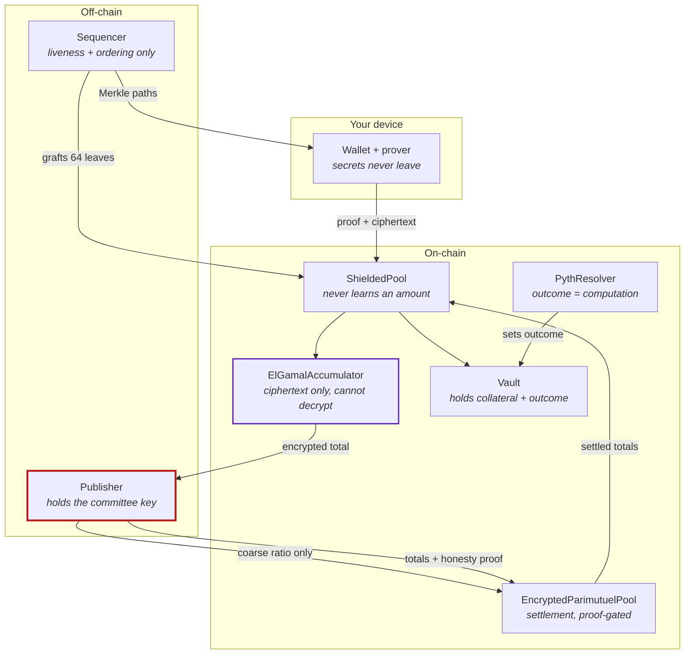
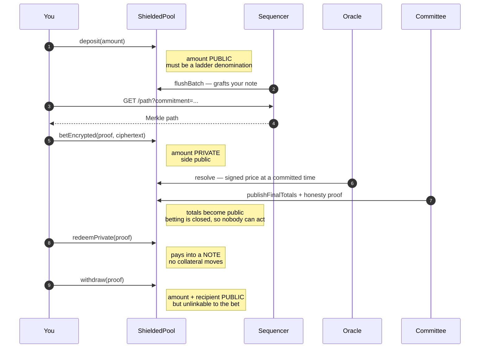

## On-chain

**ShieldedPool** — the entry point for every user action. Holds the commitment tree, the
nullifier set, and the proof verifiers. Never learns an amount.

**ElGamalAccumulator** — holds the running encrypted total per market, per side. It stores
ciphertext points and has no ability to decrypt anything. Adding a stake is point addition on
BabyJubJub.

**Vault** — custodies collateral and holds the outcome. Splits deposits into YES/NO positions
and pays out against the winning side.

**EncryptedParimutuelPool** — settlement. Accepts the decrypted final totals along with a
Chaum-Pedersen proof that the decryption is honest with respect to the published committee
key. This is the only path a payout ever reads.

**PythResolver** — resolves a market from signed price data at a timestamp committed before
betting opened. See [Resolution](/concepts/resolution).

## Off-chain

**Sequencer** — batches commitments into the tree and serves Merkle paths.

<Note>
Inserting one commitment costs more gas than a user action can afford, so actions only *queue*
a commitment and the sequencer grafts 64 at a time. Batching is a correctness requirement of
the gas budget, not an optimisation.
</Note>

The sequencer is trusted for **liveness and ordering only**. It cannot steal, cannot insert a
leaf nobody queued (the contract checks every submitted leaf against the on-chain queue), and
cannot choose padding (fillers are derived on-chain). What it can do is stall.

**Publisher** — the only process holding the committee key, and therefore the only thing that
can turn the accumulated ciphertext into a number. It decrypts the total, computes a coarse
ratio, and publishes only that.

<Warning>
The published ratio is **unverified by construction** — checking it against the ciphertexts
would require the plaintexts, which defeats the purpose. That is survivable only because **no
payout reads it.** Settlement goes through a proof. The odds are decoration; the money is
proved.
</Warning>

## The flow

<Steps>
  <Step title="Deposit">
    Collateral enters the Vault, a commitment is queued, and the sequencer grafts it into the
    tree.
  </Step>
  <Step title="Bet">
    A proof shows you own an unspent note without revealing which. The encrypted stake is
    added to the accumulator. A position note is queued.
  </Step>
  <Step title="Resolve">
    The oracle resolver reads a signed price at the committed timestamp and sets the outcome.
  </Step>
  <Step title="Settle">
    The committee publishes final totals with a proof that the decryption is honest.
  </Step>
  <Step title="Redeem">
    A winning position becomes a settled note. No collateral moves.
  </Step>
  <Step title="Withdraw">
    A settled note becomes public collateral, in a fixed denomination, at a time of your
    choosing.
  </Step>
</Steps>

## Uniform gas envelope

Monad charges the **declared** gas limit, and that limit is a public field on the transaction.
A snug per-action limit would reveal which private action you took even though the proof stays
sealed.

So every user action is submitted with one identical declared limit. Privacy has a measurable
price, and this is where it is paid. See [Limits](/reference/limits).
