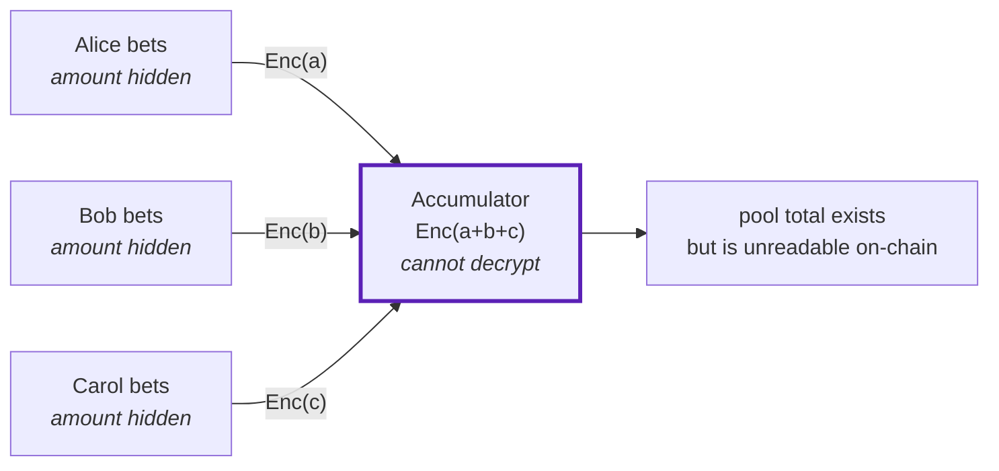

This is the part that makes Atrum possible. A prediction market needs a pool total — you cannot
divide winnings without one. But a total computed from visible stakes is a total that reveals
every stake.

Atrum computes it from stakes nobody can read.

## Exponential ElGamal

Each stake is encrypted before it ever reaches the chain. The scheme is ElGamal on the
BabyJubJub curve, in its *exponential* form:

```
C1 = [r]G
C2 = [m]G + [r]H
```

where `m` is your stake, `r` is fresh randomness you pick per bet, `G` is the curve's generator
and `H` is the committee's public key.

The ciphertext is two curve points. Nothing about `m` is recoverable from them without the
committee's secret.

<Note>
Fresh randomness per bet matters. Two bets of the same size encrypted with the same `r` would
produce identical ciphertexts, and identical ciphertexts on-chain would say "these two stakes
are equal" — a leak with no cryptography involved. The circuit refuses `r = 0` and the client
draws a new one each time.
</Note>

## Why it adds

The useful property is that ciphertexts add:

```
Enc(a) + Enc(b) = ([r₁]G + [r₂]G,  [a]G + [r₁]H + [b]G + [r₂]H)
                = ([r₁+r₂]G,       [a+b]G + [r₁+r₂]H)
                = Enc(a + b)
```

Add the two points componentwise and you get an encryption of the sum. The contract performs
that addition on every bet, and after a thousand bets it holds `Enc(total)` — having never seen
a single stake.



The accumulator contract holds ciphertext and has no decryption capability whatsoever. It is
not that it declines to decrypt — it does not possess the key, and the key is not on the chain.

## The proof that ties it together

A ciphertext on its own proves nothing. You could encrypt 1,000,000 while spending a note worth
10.

So the bet proof establishes, in zero knowledge, that:

- you own an unspent note in the tree, and
- the ciphertext you published is an encryption of **exactly that note's value**

Both facts, without revealing the note or the value. The contract accepts the ciphertext only
because the proof binds it to a real, owned, unspent note.

<Note>
This is the step where privacy would quietly break in an obvious implementation. Making the
amount private removes it from every check the contract used to perform, so each of those
checks has to move *into* the circuit. A guard that silently stops applying is worse than one
that was never written.
</Note>

## Recovering the number

Decryption gives back `[m]G` — the message multiplied by the generator — not `m` itself.
Recovering `m` from `[m]G` is the discrete logarithm problem, which is hard in general.

It is tractable here only because stakes are **bounded**. The publisher uses baby-step
giant-step, which costs about `√bound` operations: a pool of tens of millions is recovered in a
few thousand steps, in milliseconds.

That bound is not an accident. Every circuit range-checks values to 40 bits precisely so that
decryption stays feasible. An unbounded plaintext would be encrypted perfectly well and then be
unrecoverable forever.

## Who can decrypt, and what they publish

The committee key decrypts the total, and only the total — individual stakes were never
separable to begin with, since the accumulator holds their sum.

Mid-market odds come from that total, published deliberately **coarse and infrequent**. The
reason is in [Privacy model](/concepts/privacy-model): a sequence of precise ratios, combined
with publicly visible bet sides, becomes a system of equations that settlement's exact totals
can anchor.

At settlement the final totals are published in the clear along with a **Chaum-Pedersen
proof** — a zero-knowledge proof that the decryption is honest with respect to the published
committee key. Not a claim to be trusted; a proof the contract verifies.

That proof is why payouts are safe. A dishonest publisher could post any mid-market ratio it
liked, and it would not matter, because **no payout ever reads that number.** Money is divided
only by totals that came with a proof.
