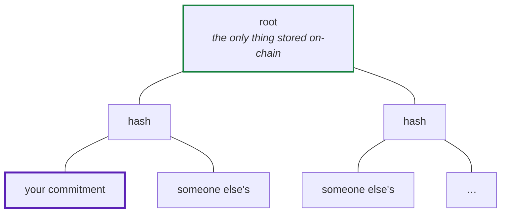
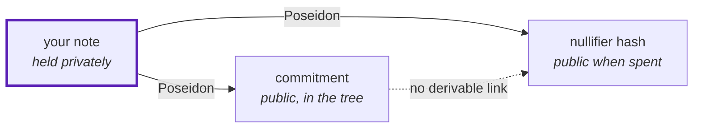

Atrum has no account balances. There is no mapping from your address to what you hold, because
such a mapping is exactly the record that would give you away.

Instead there are **notes**, and a tree of **commitments** to them.

## What a note is

A note is five numbers you keep on your own device:

| field | what it is |
|---|---|
| `nullifier` | a secret, used once to spend the note |
| `secret` | a second secret, so the commitment cannot be guessed |
| `marketId` | which market it belongs to |
| `outcome` | unbet collateral, a YES position, a NO position, or a settled payout |
| `units` | how much it is worth |

Only its **commitment** goes on-chain:

```
commitment = Poseidon(nullifier, secret, marketId, outcome, units)
```

A commitment is a hash. Anyone can see it; nobody can invert it. Two notes with the same value
produce completely different commitments, because the secrets differ.

<Note>
Poseidon rather than keccak. Poseidon is designed to be cheap to compute *inside* a
zero-knowledge circuit — a keccak hash costs tens of thousands of constraints, a Poseidon hash
costs a few hundred. Since every action proves a hash in-circuit, that choice is the difference
between a practical system and an unusable one.
</Note>

## The commitment tree

Every commitment is a leaf in one Merkle tree, 20 levels deep — just over a million leaves.



The contract stores **only the root**. It does not keep the leaves, and it could not tell you
which leaf is yours if it wanted to.

To spend a note you supply a **Merkle path** — the sibling hashes from your leaf up to the
root — and prove in zero knowledge that hashing your commitment along that path produces the
root the contract knows.

That proof says: *"one of the leaves under this root is a note I hold the secrets to."* It does
not say which.

<Note>
Your anonymity set is every unspent note in the tree. It grows with every user, which is why
privacy here is a shared resource rather than an individual setting.
</Note>

## Spending, and why you cannot spend twice

If a proof never reveals which note was spent, what stops you spending the same note over and
over?

The **nullifier hash**:

```
nullifierHash = Poseidon(nullifier, DOMAIN)
```

Every action publishes it, and the contract records it as spent. Spend the same note again and
you derive the same nullifier hash, and the second attempt is rejected.

It reveals nothing. It is a one-way hash of a secret only you know, so it cannot be worked
backwards to a commitment, and two nullifier hashes cannot be linked to each other.



The two public values both come from the same secret, and neither can be connected to the
other without it. That is the entire double-spend defence, and it costs one storage write.

## The four note states

An action consumes a note and produces a new one. The `outcome` field controls what is legal:

| state | can be bet | can be redeemed | can be withdrawn |
|---|---|---|---|
| **unbet collateral** | yes | yes, as a 1:1 refund | no |
| **YES position** | no | if YES won | no |
| **NO position** | no | if NO won | no |
| **settled payout** | no | **no** | yes |

The fourth state exists for a specific reason. A payout has to be tagged as *something*, and
every other value is a trap: tag it as unbet collateral and it could be redeemed again as a
refund, producing another payout note, forever. Each individual step would be legitimate, and
nullifiers would not stop it because each new note is genuinely new.

So payouts get a state that can only ever be withdrawn. The cycle is closed by construction
rather than by a check somebody might forget.

## Why insertion is batched

Adding a leaf to a depth-20 tree means recomputing 20 hashes, which costs more gas than a
single user action can carry alongside a proof verification.

So an action does not insert anything. It **queues** a commitment, and a sequencer grafts 64 at
a time as one aligned subtree — a **15.9× saving** per leaf.

The practical consequence: after depositing there is a short wait before your note is in the
tree and can be bet from. There is no Merkle path to a leaf that does not exist yet.
