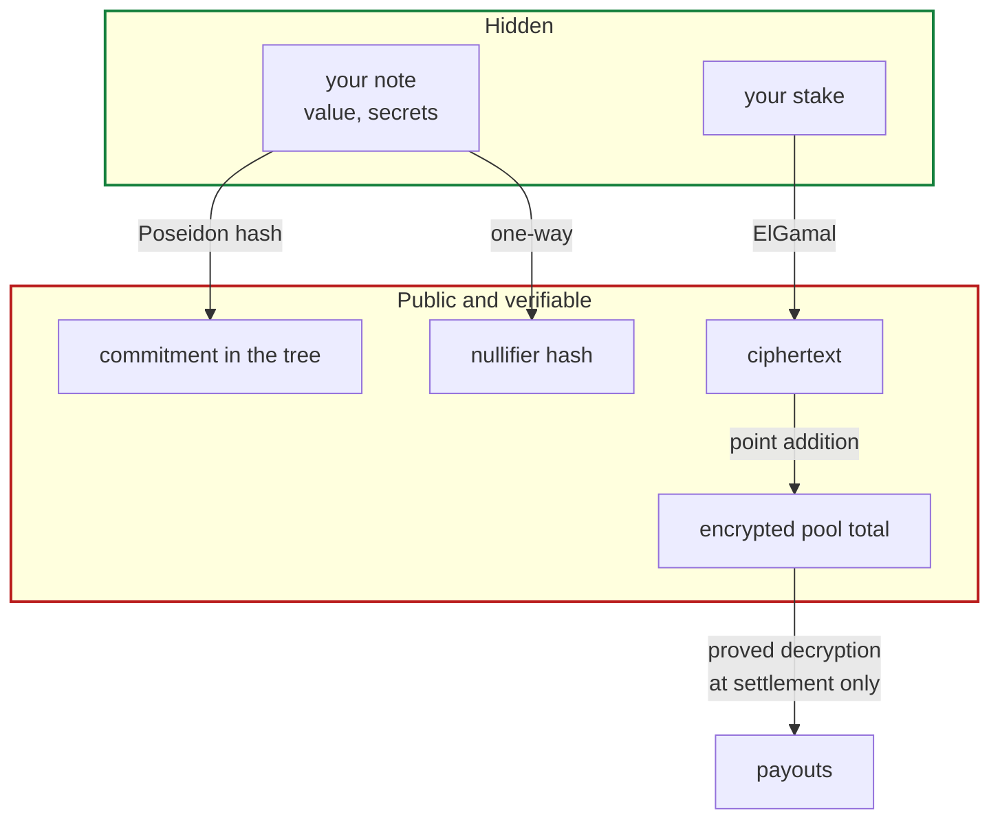

Atrum is a parimutuel prediction market in which the size of every position is encrypted. This
page is the complete picture; the pages after it go deeper on each part.

## The core idea

Three things have to be true at once, and they pull against each other:

1. The pool needs a **total**, or winnings cannot be divided.
2. Individual stakes must stay **hidden**, or the market punishes anyone with an edge.
3. Everything must be **verifiable**, because it is a public chain and nobody should have to
   trust an operator.

Atrum gets all three by never letting the contract see a stake, while still letting it add
them up.

## The four moves

**Deposit.** Lock collateral, publish a commitment to a note only you can spend. The amount is
public and must be a standard denomination, so it does not single you out.

**Bet.** Prove you own *some* unspent note without revealing which, and publish an encrypted
stake. The contract adds the ciphertext to a running total it cannot read. This is where the
link from your address to your position is cut.

**Redeem.** Once the market settles, prove your position won and receive a new note holding the
payout. **No money moves.** Nothing about you is published. This is where the link from your
position to your money is cut.

**Withdraw.** Turn a settled note into collateral in your wallet, at a time you choose, in a
standard amount. Public — but unconnected to anything above.

## Why two separate exits

Redeeming and withdrawing look like they could be one step. Combining them would undo the
product.

A parimutuel payout is whatever the arithmetic produced — 1,041, an odd number determined by
your stake and the pool. Paying that directly to an address publishes an amount that
**uniquely identifies the position that earned it**. Anyone could work backwards from the
payout to the bet.

So redemption keeps the payout inside the system as a note, and withdrawal takes out a *round*
amount later, keeping the remainder as private change. Two steps, because one would leak.

## What the contract never learns

- Which note any action spent
- How much any bet was for
- The pool total, at any point before settlement
- Which deposit funded which position
- Which position funded which withdrawal

## What is public, deliberately

- That a bet happened, and **which side** it backed
- Deposit and withdrawal amounts, in standard denominations
- The final pool totals, **after** betting closes and the outcome is known
- Coarse mid-market odds while betting is open

The full accounting is in [Privacy model](/concepts/privacy-model).

## Where to go next

<CardGroup cols={2}>
  <Card title="Notes and commitments" icon="key" href="/concepts/notes-and-commitments">
    How ownership works without a record of who owns what.
  </Card>
  <Card title="Encrypted totals" icon="calculator" href="/concepts/encrypted-totals">
    How a contract adds numbers it is not allowed to read.
  </Card>
  <Card title="Why parimutuel" icon="scale-balanced" href="/concepts/why-parimutuel">
    The constraint that decides the entire market design.
  </Card>
  <Card title="Resolution" icon="gavel" href="/concepts/resolution">
    Why the outcome is a computation and not a decision.
  </Card>
</CardGroup>
