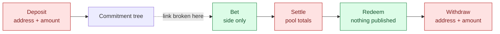

This is the most important page in these docs. Atrum's privacy claim is specific, and it is
easy to overstate in a way that a reader who opens the contracts will immediately catch.

## The one-line version

**Everyone sees that a bet was placed and which side it backed. Nobody sees how much, or
whose.**

<Note>
Red is public, green is private. The dotted edge is the whole product: a bet proves it owns
*some* note in the tree without revealing which, so the chain from your address to your
position is cut there.
</Note>

## Step by step

<Steps>
  <Step title="Deposit — public">
    Your address and the exact amount are visible. They have to be: real collateral moves, and
    a transfer is visible on any public chain. No cryptography hides that.

    Deposits must be in **fixed denominations** (powers of ten), enforced on-chain. An amount
    nobody else uses is a name tag — see [Why denominations are a consensus
    rule](#why-denominations-are-a-consensus-rule).
  </Step>

  <Step title="Bet — the amount is hidden">
    This is the step that does the work.

    Your bet proves it owns *some* note in the commitment tree without revealing which one. An
    observer knows a deposit is being bet, but not whose. The stake itself is encrypted and
    the contract adds it to a running total it can never read.

    **Public:** that a bet happened, and its side. **Private:** the amount, and which deposit
    funded it.
  </Step>

  <Step title="While betting is open">
    Odds are published from the encrypted total — deliberately coarse (1% buckets) and
    infrequent (at most one publication per several bets). See [Why the odds are
    coarse](#why-the-odds-are-coarse).
  </Step>

  <Step title="Settlement — totals become public">
    The final pool totals are revealed exactly. This is deliberate: a pro-rata payout needs
    real numbers, not a rounded ratio, and it is safe because betting has closed and the
    outcome is known, so nobody can act on it.

    Individual stakes are still not revealed.
  </Step>

  <Step title="Redeem — nothing moves, nothing is published">
    A winning position redeems into a **new shielded note**, not to an address. No money moves
    and no amount is published. The link between your position and your payout is severed
    here.
  </Step>

  <Step title="Withdraw — public again">
    The recipient address and the amount are public. Money is leaving; a transfer is visible.

    What stays hidden is *which* note funded it, *which* bet earned it, and *when* relative to
    your position — you withdraw at a time of your choosing, in a fixed denomination, with the
    remainder kept as a private change note.
  </Step>
</Steps>

## What this means honestly

<Warning>
Atrum provides **unlinkability, not invisibility.** Your deposit and your withdrawal are both
public events. What is broken is the link between them, and the size of what sits in between.
</Warning>

**It is only as strong as the crowd.** With one user there is no anonymity set and nothing is
private. No cryptography changes that.

**Timing still leaks if you are careless.** Deposit 100, withdraw 100 five minutes later, and
you have linked yourself regardless of what the contracts do.

## Why denominations are a consensus rule

An odd deposit does not only expose its owner. Each distinct amount is its own anonymity
bucket, so one non-standard deposit **shrinks the set for everyone else too**.

That makes it a shared-safety property, and shared-safety properties belong in consensus, not
in a wallet that a power user can bypass by calling the contract directly. So the contract
refuses any deposit that is not on the ladder.

## Why the odds are coarse

A single published ratio leaks nothing about magnitudes — `yes / (yes + no)` is scale-free.

A *sequence* of ratios is a different object, because three things are already public: every
bet is a visible transaction, each bet's side is public, and settlement reveals exact totals.
Each published ratio is then one equation in the running sums, and settlement supplies the
absolute scale a ratio alone would not. Publish once per bet at full precision and an observer
ends up with roughly as many equations as unknown stakes.

Atrum bounds this two ways: by capping the **number** of equations (several bets must land
between publications) and by degrading each from an equality into an interval (1% buckets).

<Note>
That is a bound on a known attack. **It is not a proof of privacy**, and the code says so.
</Note>

## Current limits

Two things are true today and must change before real money:

- **The trusted setup has a single contribution.** Whoever holds that randomness could forge
  proofs.
- **Decryption uses a single committee key**, held by the operator — who can therefore decrypt
  every individual bet.

Both are tracked in [Limits](/reference/limits).

## Words to avoid

<CardGroup cols={3}>
  <Card title="Anonymous" icon="xmark">
    Deposit and withdrawal addresses are public.
  </Card>
  <Card title="Fully private" icon="xmark">
    Bet sides and settled totals are public.
  </Card>
  <Card title="Untraceable" icon="xmark">
    There is an on-chain footprint; it just does not identify you.
  </Card>
</CardGroup>

The accurate claim: **your position size is hidden while you hold it, and your payout cannot
be traced back to your bet.**
