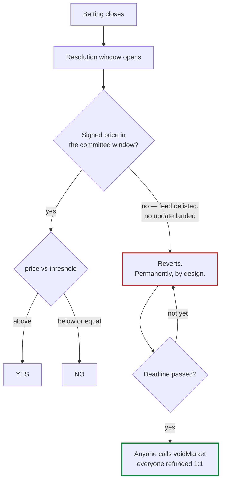

A market's outcome is a **computation, not a decision**.

## How it works

Every market commits to its question before betting opens. The commitment is a hash stored
immutably in the Vault, covering:

- which price feed
- the threshold, and the direction (`above` or `below`)
- **the exact timestamp** the price is read from
- how long an update may lag that timestamp

At resolution, anyone submits a signed price update. The resolver checks the supplied question
against the committed hash, verifies the signatures through Pyth, and compares. Then it sets
the outcome.

## What the caller cannot choose

Resolution is permissionless, which is only safe because the caller has no useful freedom:

- **Not the question** — the spec must hash to the vault's immutable commitment.
- **Not the timestamp** — it is inside that hash.
- **Not the price** — signatures are verified on-chain, and the update must be the *first* one
  at or after the target time.
- **Not the outcome** — it is a comparison.

<Note>
The third point is subtle and worth spelling out. Pyth publishes roughly every 400ms, so a
60-second window holds around 150 candidate prices. If any of them were acceptable, whoever
called `resolve` could pick the one that suited them. Atrum instead pins the result to the
**first** update at or after the target time, with proof that no earlier one exists — so there
is nothing to choose.
</Note>

## Why the price must come from after betting closed

The resolver refuses any market whose target time is earlier than its betting close. A market
settled on a price that was already knowable while people were still betting is not a
prediction market — it is a payout to whoever checked.

## When a market cannot be answered

If a feed is delisted, or no signed update ever lands in the window, resolution reverts
permanently — by design, because that is the same property that makes it trustworthy.

So there is an escape hatch. If a market is still unresolved a fixed period after resolution
opened, **anyone** can void it and everyone is refunded 1:1, whichever side they backed.

It is deliberately not a control anyone can reach for:

- It refuses an already-resolved market, so nobody can void an outcome they dislike.
- It refuses before the deadline, so nobody can race a slow resolver.
- The resolver itself cannot declare a void.

There is no key, no committee and no judgement behind it — only the clock.
