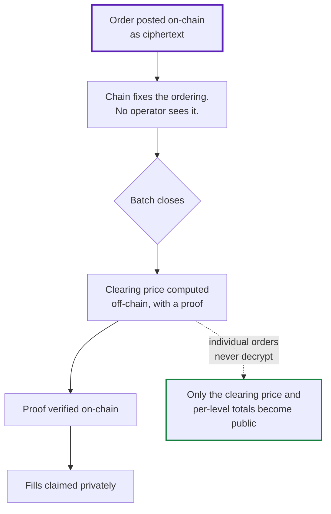

<Note>
**Status: in development, not shipped.** V1 — the parimutuel pool described elsewhere in
these docs — is what runs today. This page describes what replaces it and why. Figures below
are measured on Monad testnet; anything unmeasured is labelled.
</Note>

## What was wrong with V1

V1 works. Deposits, encrypted bets, private redemption and untraceable withdrawal all
function on-chain today. It also has no volume, and the reason is structural rather than
promotional.

A parimutuel pool locks you in. You stake, and you cannot leave until the event resolves.
There is no selling, no price to react to, and no reason for a market maker to show up. That
is a lottery with extra steps, not a market — and no amount of distribution fixes a mechanism
problem.

## The argument that turned out to be too strong

[Why parimutuel](/concepts/why-parimutuel) sets out the constraint, and the constraint is
real: additively-homomorphic encryption lets a contract **add** ciphertexts but never
**compare** them, and order matching is comparison.

The step that does not follow is *therefore no order book*.

Matching never had to happen inside the contract. Polymarket's order book does not run
on-chain either — it runs on their servers, and only settlement touches the chain. The
constraint bounds what the *contract* can do; it says nothing about what the *system* can do.

Once that is separated, the question changes from "can a contract compare ciphertexts?" —
no — to "can the chain hold sealed orders and verify a clearing price computed elsewhere?"
That one has an answer.

## What V2 is

A **sealed-bid batch auction**, settled on-chain.



1. **Orders are posted on-chain as ciphertext**, encrypted to a committee key. The chain
   determines their ordering, not an operator.
2. **Nobody can read them** — not other traders, not the sequencer, not us.
3. **The batch closes, and only then does anything clear.** Every order is already committed
   by that point, so inserting into a closed batch is impossible. Front-running is not
   discouraged or penalised; it is structurally excluded.
4. **The clearing price is published with a correctness proof.** Anyone can compute it — the
   solver role is permissionless.
5. **Fills are claimed privately.**

Positions use the conditional-token model: one unit of collateral mints one YES and one NO,
the winner redeems for one and the loser for zero. That is what makes a position tradeable
before the event resolves.

## How a price is found without decrypting anything

The interesting part, because it is where the original argument said the wall was.

A clearing price is where aggregate demand crosses aggregate supply. **Both curves are
cumulative sums** — and summing ciphertexts without decrypting them is precisely the property
Atrum already relies on for [encrypted totals](/concepts/encrypted-totals).

Quantise price into levels. The demand curve is non-increasing in price: a buyer willing to
pay 60¢ is willing to pay anything below it. So an order's contribution is a single step at
its own limit, which means **an order writes to exactly one price level** — not to every
level beneath it.

```
order (buy S at limit p)   ->   levels[p] += Enc(S)
aggregate demand at q      ->   sum of levels[q..top]
```

The aggregate at any price is a suffix sum over encrypted level totals, computed on-chain by
addition alone. No comparison, no decryption of anything individual.

A solver then proves — in zero knowledge — that every committed order was added to the level
its own private limit specifies. Individual orders never open. Only per-level aggregates do,
which is the same class of disclosure V1 already makes when it publishes per-outcome totals.

<Note>
No sorting is involved. Sorting was the expensive route to the same property; the price grid
is the fixed structure a sorting network would otherwise have to discover.
</Note>

## What is public, and what is not

| | V1 (today) | V2 |
|---|---|---|
| Your position size | hidden | hidden |
| Which side you took | **public** | hidden |
| Your limit price | n/a | hidden |
| Payout traceable to your bet | no | no |
| Your address beside your action | no | no |
| Clearing price and total volume | n/a | public — this is the forecast |

V1 emits an event naming the outcome you bet on, so direction is public today. V2 removes
that. **On what it reveals, V2 is strictly more private than V1**, not a trade against it.

One leak is irreducible in any batch auction: if your order filled, your limit was on the
winning side of the clearing price, and the order at the margin is partially filled. It is
small, and it is disclosed rather than mitigated.

## Measured cost

From testnet, with the method and full tables in the repository's evidence register.

| | |
|---|---|
| Posting a sealed order | 115,589 gas |
| Clearing sweep, both sides | 945,182 gas |
| Routing proof | 4.08 constraints per order-level pair |
| Batch clearing | flat in order count |

The last row is the one that matters. Clearing cost is set by the number of price levels,
which is fixed at design time — a batch of 64 orders and a batch of 6,400 clear for the same
gas. Above roughly eleven orders per batch, **keeping every order encrypted is cheaper than
opening the batch.**

Privacy here is not a premium paid for a principle. Past a threshold well below the batch
size, it is the cheaper design.

## What V2 does not fix

**Anonymity still scales with participation.** A sparse batch is both an inactive market and
a weak anonymity set. This is a property of the mechanism and cryptography does not repair it.

**Batches clear periodically, not continuously.** For markets resolving over hours or days
this is immaterial, and continuous matching is what leaks by construction.

**The trusted setup ceremony has not been performed.** Proving keys currently derive from a
single machine's entropy, which means forged proofs are possible. Nothing in Atrum should be
described as trustless until that changes, and V2 does not change it — the ceremony is
scheduled separately and will be published in full.

**The decryption committee is still a single key.** Moving to a threshold committee requires
new circuits, new verifiers and a new ceremony, because the committee key is compiled into
the circuits. It is a dependency chain, not a configuration change.
