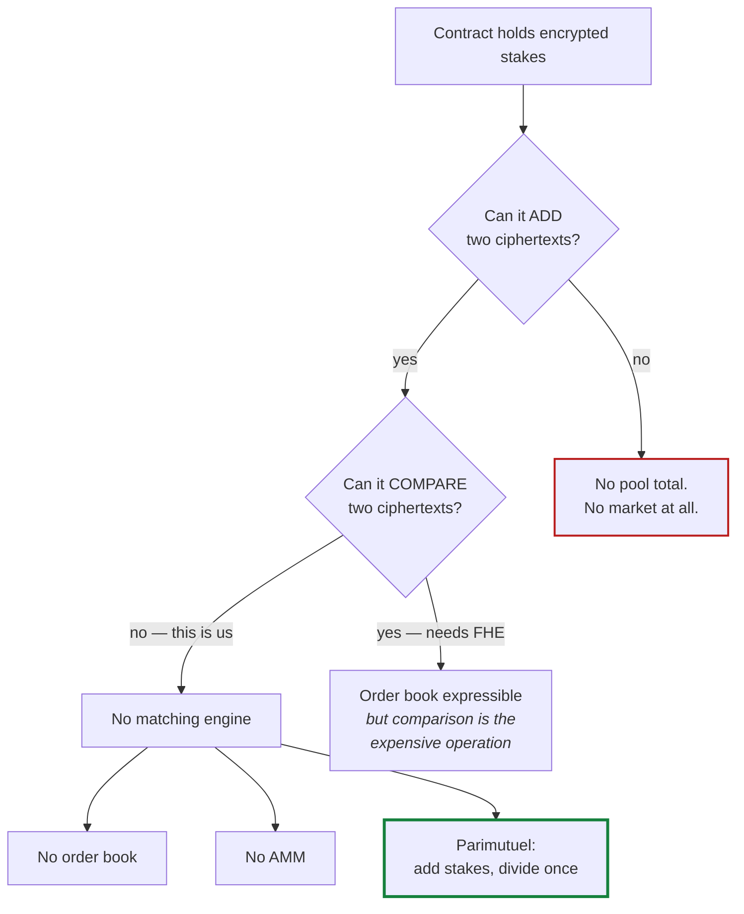
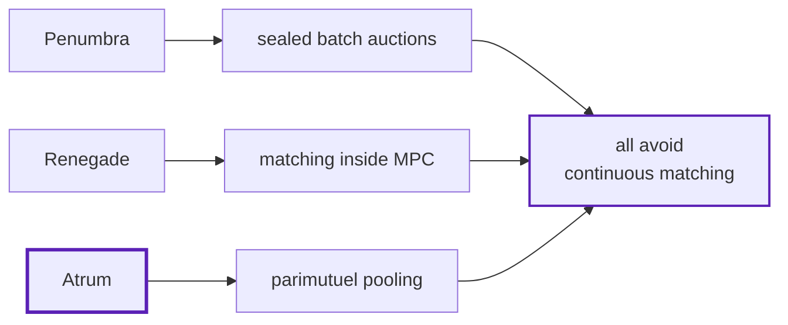

Atrum is a parimutuel pool, not an order book. That is not a preference or a simplification —
it is the only mechanism that works under the constraint.

## The constraint

Atrum uses **additively-homomorphic encryption**. Given two ciphertexts the contract can
compute the encryption of their sum, without ever learning either value. That is what lets a
pool total exist while individual stakes stay hidden.

What it cannot do is **compare**. There is no operation that takes two ciphertexts and tells
you which is larger.

## Why that rules out an order book

Order matching is comparison. *Is this bid at least the ask?* Every matching engine ever
written is built on that question.

A contract that can add but not compare cannot match orders. So:

- **No order book.** Matching is comparison.
- **No AMM.** Pricing curves need to compare a trade against reserves.
- **Parimutuel.** Everyone stakes into a pool, and winners split it pro rata. Payouts need
  only addition and one division at settlement — no comparison at any point.

<Note>
This is why nobody has retrofitted privacy onto an existing prediction market. It is not that
it would be difficult; the market design itself has to change.
</Note>

## Everyone hits this wall

Look at what private trading systems actually do:

- **Penumbra** batches trades into sealed auctions.
- **Renegade** matches inside multi-party computation.
- **Atrum** pools.

Nobody runs a private *continuous* order book in production, because continuous matching leaks
by construction whatever cryptography is underneath.

## What parimutuel costs you

Being honest about the trade:

- **No live price to trade against.** You stake; you do not take a quote.
- **No partial fills or limit orders.** You are in the pool or you are not.
- **Odds move after you commit.** Later money changes your payout, and you cannot react.

That last one is real and it is not fixed by better cryptography — it is a property of the
mechanism. A bettor who is right early is diluted by money that arrives later.

## Would FHE change this?

In principle yes. Fully homomorphic encryption permits arbitrary computation on ciphertexts,
including comparison, so an encrypted order book becomes *expressible*.

Expressible is not practical. Comparison is the expensive FHE operation, and matching one
order against a resting book needs many of them. The realistic first version is a **periodic
batch auction**, not continuous matching — which is, again, a form of batching.

FHE also does not remove the need for a decryption committee. It relocates the trust; it does
not delete it.
