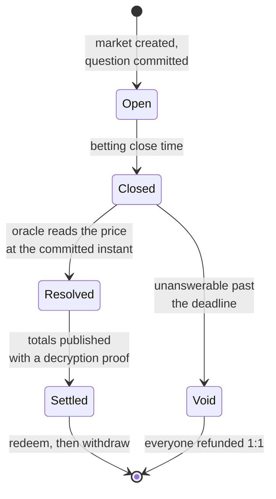

## Creation

A market is created with its question **committed up front** — the price feed, the threshold,
the direction, and the exact instant the price is read from — hashed and stored immutably
before anyone can bet.

Its schedule is immutable too. Betting close and resolution times are fixed at creation and
cannot be moved by anyone, which removes the possibility of a deadline shifting once it is
clear how a market is going.

## While betting is open

Deposits and bets are accepted. The encrypted total grows with each bet. Coarse odds are
published periodically.

The contract enforces a minimum gap between betting close and resolution. A market cannot close
and resolve in the same breath — the price being asked about must come from after the last bet
was placed.

## Resolution

Anyone may trigger it. The caller supplies signed price data; the contract checks it against the
committed question, verifies the signatures, and compares. The outcome falls out.

The caller cannot choose the question, the timestamp, the price, or the outcome. See
[Resolution](/concepts/resolution).

## Settlement

The committee publishes the final totals along with a proof that the decryption is honest. Only
now do the pool totals become public — after betting has closed and the outcome is known, so
nobody can act on the information.

## Payout

Winners redeem into settled notes, then withdraw whenever they choose. There is no deadline on
either: a settled note remains yours indefinitely, and waiting is itself a privacy measure,
since a withdrawal that follows settlement immediately is easier to correlate.

## If a market cannot be answered

Feeds get delisted. Data goes missing. When resolution becomes impossible, the market would
otherwise stay open forever with everyone's stake inside it.

So after a fixed period, **anyone** can void it and everyone is refunded 1:1, whichever side
they backed. It cannot be used to escape a losing position — a market that already resolved
cannot be voided, and the deadline cannot be raced.
