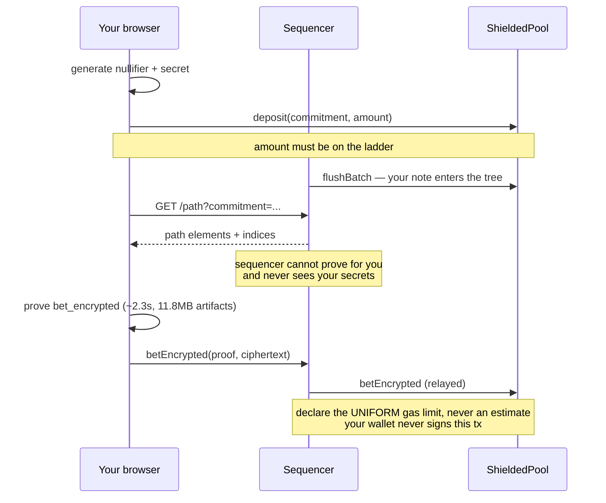

Every proof is generated **in the client**. No server ever sees your secrets.

The transactions that carry them are often relayed, too: `betEncrypted`, `redeemPrivate`, and
`withdraw` can be submitted by the sequencer on your behalf, so your wallet never signs them.
Only `deposit` always needs your own wallet — it pulls real collateral via
`transferFrom(msg.sender)`, so relaying it would not remove anything.

<Steps>
  <Step title="Deposit">
    Call `deposit` with a commitment and an amount **on the denomination ladder** (powers of
    ten). Anything else reverts — an unusual amount would identify you, and would shrink the
    anonymity set for everyone else.

    Keep the note's nullifier and secret locally. They are the only way to spend it.
  </Step>

  <Step title="Wait for the graft">
    Your commitment sits in a queue until the sequencer inserts it. You cannot bet from a note
    that is not yet in the tree, because there is no Merkle path to prove membership with.

    <Note>
    Changed your mind before betting? A deposit that's still unbet can be withdrawn straight
    back out at any time — no market, no redeem step, just a direct exit.
    </Note>
  </Step>

  <Step title="Fetch a Merkle path">
    Your client asks the sequencer for the sibling hashes between your leaf and the root. The
    sequencer can produce a path but **cannot produce a proof** — it never sees your secrets,
    and the path alone is useless without them.
  </Step>

  <Step title="Build the proof">
    Your client feeds the note, the path, and the encrypted stake into the proving circuit. The
    proof establishes two things at once: that you own an unspent note in the tree, and that
    the ciphertext you are publishing encrypts exactly that note's value — without revealing
    either.

    <Note>
    Proving is not instant. Measured in Node: around 2.3 seconds, with roughly 11.8 MB of
    circuit artifacts to fetch first. Cache them, and prove in a Web Worker or the UI will
    freeze.
    </Note>
  </Step>

  <Step title="Submit">
    Hand the proof, the public signals, and the ciphertext to the sequencer, which relays
    `betEncrypted` for you, declaring the **uniform gas limit**, never an estimate — an estimate
    leaks which action you took. Relaying is proof-gated: the sequencer cannot forge or alter
    what you proved, only submit it, so correctness never depends on trusting it — only
    liveness does. Your client can also submit the transaction itself if you'd rather not use a
    relayer; either way, the proof is what the contract checks.
  </Step>
</Steps>

## After the market resolves

<Steps>
  <Step title="Redeem privately">
    Prove your position won and receive a **settled note**. No collateral moves and no amount
    is published — this is the step that breaks the link between position and payout. Relayed,
    same as the bet.
  </Step>
  <Step title="Withdraw">
    Spend the settled note for public collateral, in a ladder amount, keeping the remainder as
    a private change note. Withdraw whenever you like; timing is part of your privacy. Relayed
    too — the recipient address is public because collateral has to land somewhere, not because
    you signed the transaction.

    <Note>
    Some deployments also top up the recipient with a little native gas right after, in a
    follow-up transaction, so a freshly-used address has enough to transact again. Optional,
    operator-configured.
    </Note>
  </Step>
</Steps>
